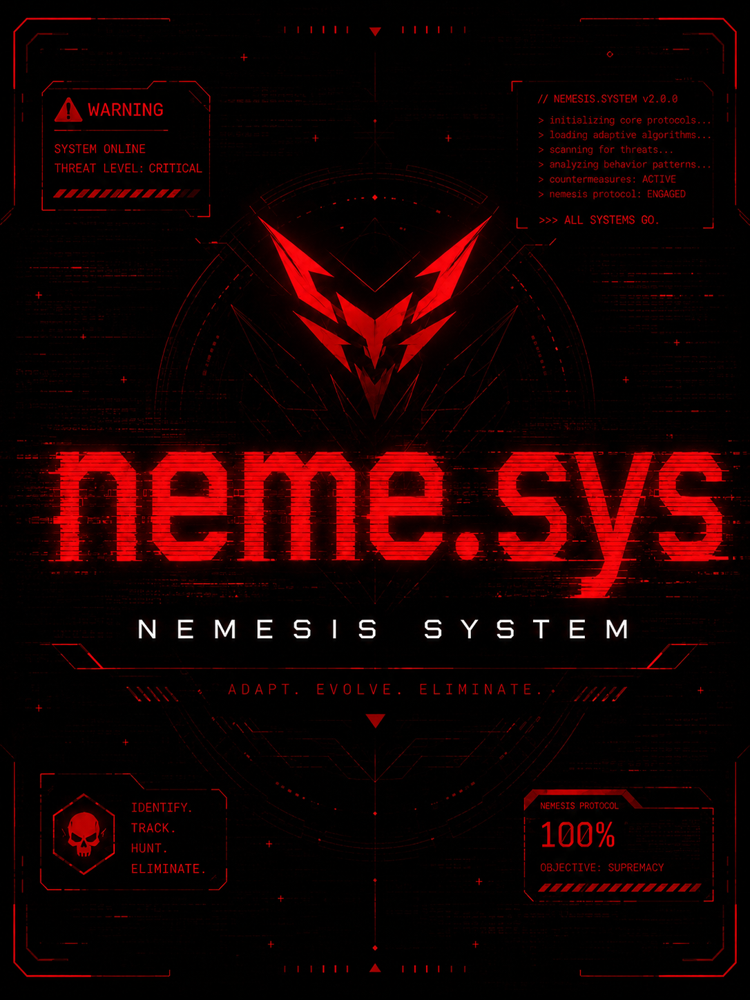

# Neme.sys

Neme.sys is a persistent NPC continuity system for AI Dungeon inspired by the Nemesis System. Significant characters can remember what you did to them, carry lasting injuries and grudges forward, change over time, disappear from the story, and eventually return on their own.

Shoot a thug in the knee and leave him alive, and he may come back weeks later limping, carrying new chrome, and looking for revenge. Spare an enemy, humiliate a rival, betray an ally, or leave someone with a reason to remember you—Neme.sys keeps that history alive.

## Features

- Automatically detects NPCs who develop significant unresolved history with the player
- Persistent injuries, scars, prosthetics, status, relationships, motivations, and history
- Nemeses can return naturally without the player manually summoning them
- Context-aware returns—the AI can delay an appearance when it would not make sense
- NPCs continue evolving while preserving the consequences of past encounters
- Persistent, editable `⚔ Nemesis` Story Cards
- Nemeses can disappear from the active story without losing their continuity
- Supports changing motivations, rivalries, grudges, debts, and other evolving relationships
- Designed to allow retreat, survival, surrender, revenge, negotiation, and recurring encounters instead of forcing every conflict to end in death
- Standalone system with optional Inner Self integration

## Setup

1. Open the **Configure Nemesis** Story Card.
2. Enter your player character's name.
3. Adjust return frequency or other settings if desired.
4. Play normally—Nemeses are discovered automatically.

## FAQ

- You do **not** need to manually choose who becomes a Nemesis.
- Let important NPC encounters resolve naturally; the system looks for meaningful consequences.
- Nemesis Cards preserve objective continuity such as injuries, history, status, and current motivations.
- Edit the **Notes** section of a Nemesis Card if you ever need to manually correct its continuity.
- Default return settings are designed to keep recurring characters from appearing constantly.

## Inner Self Integration

Neme.sys can automatically register Nemeses with Inner Self when it is installed. The two systems handle different parts of the character:

- `⚔ Nemesis`—what objectively happened to them and how their situation has changed
- `🎭 Brain`—what they think, fear, believe, remember, and plan

Together, NPCs can both **remember what happened to them** and **develop their own response to it**.
